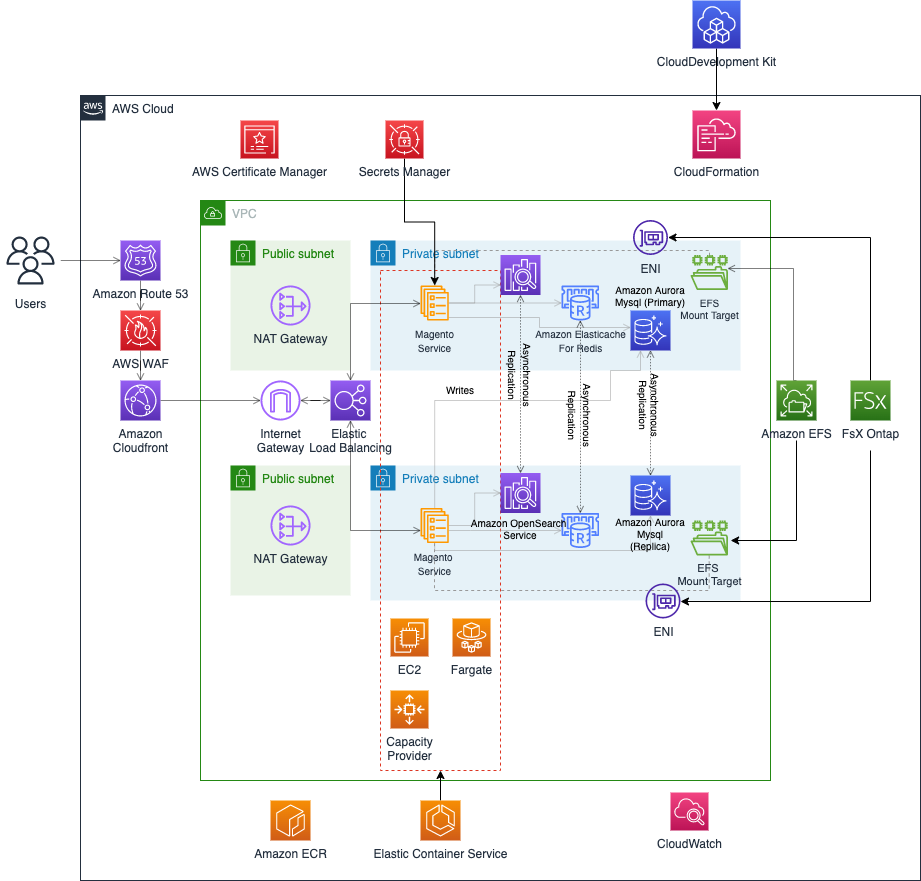
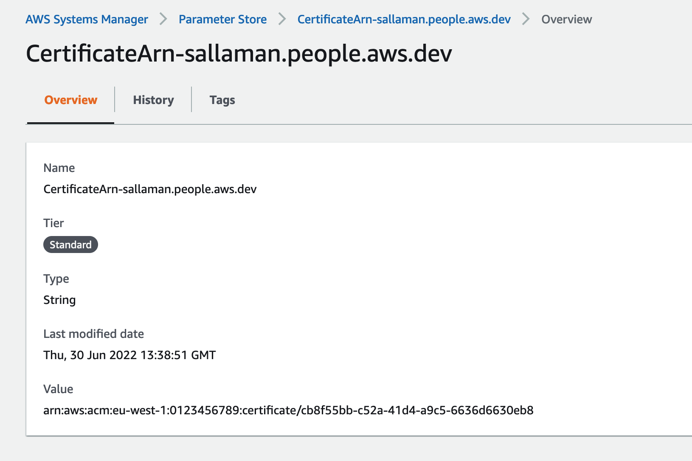
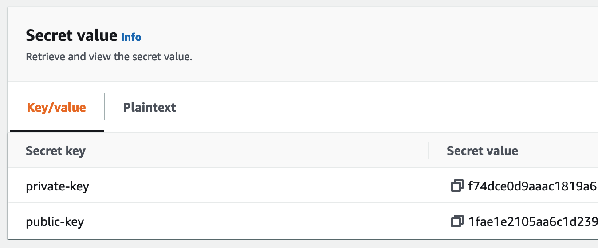

# Magento deployment on AWS using ECS (on EC2 or Fargate), RDS, OpenSearch, and (EFS of FsX OnTap) deployed with CDK

## Overview

This repository consist of a sample project providing infrastructure as code based on [AWS Cloud Development Kit (AWS CDK)](https://aws.amazon.com/cdk/) in order to run open-source e-commerce Magento software platform. The CDK application will deploy highly-availablen and scalable Magento platform by leveraging Amazon [Elastic Container Services (Amazon ECS)](https://aws.amazon.com/ecs/) and several additional AWS services.

This project is not intended to be used as-is for production. It provides an example of how to use AWS services for running the Magento sample-demo application. The repository is only provided to describe "the art of possible"


## Architecture

The following diagram shows the high-level architecture for the solution.



The Magento platform consist of several core and optional components:

- A web server capable of supporting PHP-based applications (we will uses Amazon ECS on Fargate or EC2)
- The database server MySQL (we will uses AWS RDS Aurora service)
- ElasticSearch (we will uses AWS OpenSearch to handle this function)
  Optional components for Magento includes:
- A page caching mechanism (we will uses AWS ElastiCache)
- A session storage mechanism (we will uses AWS ElastiCache)
- A shared file system between tasks (the solution propose AWS EFS or AWS Fsx Ontap)

For this implementation, we rely on Magento open-source packaged into a docker containers image by Bitnami's [bitnami-docker-magento](https://github.com/bitnami/bitnami-docker-magento) project

All this architecture is created as code using AWS Cloud Development Kit (CDK) using Typescript flavour, the components are deployed as follows:

- The web application is deployed on AWS ECS container orchestrator using AWS ECS container Orchestration (on Fargate or EC2).
  - An Amazon Route53 Hosted zone must exist and will be configured for the magento subdomain on which the application will be exposed.
  - Magento Service will expose tasks from an AWS Load Balancer, on the specific domain name.
  - Magento Admin Service can be used for administrative tasks thanks to the `ecs exec` features, allowing administrators to securely connect into the admin task.
  - EC2/Fargate can scale up and down thanks to ECS Autoscaling mechanism to adapt your infrastructure with the incoming load on the load balancers.
- The Application Load Balancing forward incoming requests directly to the web application service tasks.
- The database component is hosted in Amazon Aurora MySQL compatible service.
- The Magento search feature is powered by Amazon OpenSearch service (compatible with ElasticSearch)
- The pages generated by PhP will be cached in AWS Elasticache service to decrease latencies
- In order to accelerate page loads and provide Global access for customers, the application load balancer will be fronted by Amazon CloudFront service, on which we can enable AWS WAF security features to protect the commerce site.
- The php sessions will be stored in AWS Elasticache, so that user can keep their current session no matter on which Magento task service they will be routed
- The TLS communication will be handled by an AWS Certificat Manager certificat.
- AWS Secrets Manager will be used to store severals secrets generated by the CDK (Magento password, databases secrets) and some external secrets that can be necessary (Magento Account credentials)

You can see how this project was bootstraped [here](docs/project_setup.md)

### Project Pre-requisites

#### You will need to have some installed tools

- [npm](https://docs.npmjs.com/downloading-and-installing-node-js-and-npm)
- [npx](https://www.npmjs.com/package/npx)
- [projen](https://www.npmjs.com/package/projen)
- [make](https://www.gnu.org/software/make/)
- [cdk](https://docs.aws.amazon.com/cdk/v2/guide/getting_started.html)
- [aws cli](https://docs.aws.amazon.com/cli/latest/userguide/getting-started-install.html)

#### You Need a Route53 hosted zone and a wildcard certificate on it

In my case, i'm using a personal hostedzone in Amazon Route53: sallaman.people.aws.dev, so I create a certificate in [AWS Certificate Manager](https://console.aws.amazon.com/acm/home) for `*.sallaman.people.aws.dev`.

#### Create a paremeter to your Certificate

In [AWS Systems Manager parameter store](https://console.aws.amazon.com/systems-manager/parameters/), Create a parameter named `CertificateArn-<your-hosted-zone.route53.com>`, and store the Arn of the previously created certificate.



#### You will need to create AWS Secrets for Magento MarketPlace Credentials.

First If you don't already have Adobe Magento accout, you can create one on https://devdocs.magento.com/guides/v2.3/install-gde/prereq/connect-auth.html

Go to My `Account/Marketplace/Access Keys` and create a New Access Key.

and then you will populate Magento secrets in [AWS SecretManager console](https://console.aws.amazon.com/secretsmanager) with name : **MAGENTO_MARKETPLACE** and value/pair:

```
| Secret key  | Secret Value                      |
| ----------- | --------------------------------- |
| private-key | **private-key-from-magento-site** |
| public-key  | **public-key-from-magento-site**  |
```

> Be careful the copy button may introduce a space in the credentials, you need to remove it.



### Project Configuration

First of all, you must specify a stack name that would be used to create your stack. This is done with an environment parameter `CDK_STACK_NAME` which defaults to `magento`.

```bash
export CDK_STACK_NAME=magento
```

> **IMPORTANT** Note: $CDK_STACK_NAME is also used to create database name and domain names, so valid characters are `a-z` (lowercase only) and `0-9`
>
> - because of that, the lenght of $CDK_STACK_NAME must be < 13 char

This variable can be exported in your environment before creating the CDK stack.

In the `.projenrc.js` configuration file, you can configure how the stack will be deployed inside your AWS Account.

After updating the **context** section, you will need to run again `npx projen` in order to generate the appropriate cdk.json file from the Projen bootstrap structure.

```bash
  context: {

    useFSX: 'yes', // if true, /bitnami/magento directory will be mapped to a new empty FSX volume.

    ec2Cluster: 'yes', // if yes, create en EC2 based cluster (required for FsX), if no create Fargate cluster

    //you can specify instance types for EC2, RDS and Elasticache
    ec2InstanceType: 'c5.9xlarge',
    rdsInstanceType: 'r6g.8xlarge',
    cacheInstanceType: 'r6g.8xlarge',


    route53_domain_zone: 'your-hosted-zone.route53.com', // **VERY IMPORTANT** it will not work without a valid route53 hosted zone for https

  }
```

> We recommend using `useFSX: 'yes'`, `ec2Cluster: 'yes'` for better performqnces on the shared filesystem
> **WANING** You need to configure `route53_domain_zone: 'your-hosted-zone.route53.com'` because our magento setup don't work without https

You can find more details of available configuration parameters [here](doc/configuration.md)

## Generate and deploy

Synthesize and generate the CloudFormation template from the CDK Typescript code:

```bash
make synth
```

Deploy the stack into your AWS account

```bash
make deploy
```

The deploy action will apply the CDK generated-CloudFormation template to your AWS Account. (Warning, the services deployed here will incur costs in your account, this is not covered by the AWS free tier).

> The Deployment will took up to 50 minutes if on EC2 (and 25mn on Fargate)
> Once the Deployment is finished, the Magento installation will take 25 minutes if using FsX Ontap and up to 60 minutes if using EFS (see below)

## Magento startup

By default cdk will create empty magento docker image from [Dockerfile](docker/Dockerfile) and we create 2 ECS services from this image:

- MagentoAdmin service
  - The magento admin service in ECS has only 1 task and is not accessible through the Load balancer.
- Magento service
  - The magento service number of tasks is configured with `magentoMinTasks`, `magentoMaxTasks`, and the autoscaling rules.
  - The tasks are exposed behind an application load balancer configured with the CDK_STACK_NAME and the hosted zone you provide.

When creating Magento services for the first time, The magento service entrypoint, will check if magento has been properly setup. If it is not the case, it waits for it to be. Because the ECS Magento service is using a Load balancer, it is possible that the tasks will be killed by ECS because they took too much time to register in the ALB, and ECS will create a new taks that will follow the same processus until magento is ready.

The Magento Admin taks, is responsible for the setup of Magento. So the [entrypoint](docker/entrypoint.sh) will behave otherwise if on Admin task, and will stat to bootstrap Magento.
Once Magento is ready it will install the demo website using the [post-init](docker/scripts/post-init/01-install-sample-data.sh) script. When the install is ready, the admin task write the `/bitnami/magento/__INIT_IS_OK__` file in the shared filesystem
to let other magento tasks know that bootstrap is over and that they can start.

> You can tweak thoses deployment script, to setup your own magento website, and you can also provide with your own based magento docker image.

This setup process will take approximately 25 to 40 minutes, so during this time, your website will not be yet available.

### Using the Admin Task

If you want to install specific Magento content or execute commands, you can use the magentAdmin service to exec into.
Use the Cdk output (or CloudFormation output in console) to get the connect command: exemple : `ecs_exec_service $CDK_STACK_NAME MagentoServiceAdmin magento`

This will create a secure shell (the session is encrypted with a dedicated AWS KMS key generated for you by CDK) within your tasks, and all your commands will be stored in a dedicated CloudWatch log group (/ecs/secu/exec/${CDK_STACK_NAME}).
The magento user and file systems rights are using the unix `daemon` user. When you connect into the task with `ecs exec` you are connected into the unix `root` user. It is important to immediately switch to the `daemon` user in order to not messed up with the shared file system permissions when running magento command

Connect to the Admin task and switch to daemon user:

```
$ source src/helper.sh
$ ecs_exec_service magento MagentoServiceAdmin magento
root@ip-10-0-137-105:/# su daemon -s /bin/bash
```

You can test the server is running

```bash
$ ecs_exec_service magento MagentoService magento
root@ip-10-0-145-190:/# curl -H "Host: $MAGENTO_HOST" localhost:8080
```

You will be able to connect to the Admin task when required to Fix issues, see [troubleshooting section](doc/troubleshoot.md)

### Warm up page cache

Caching pages in solution like Magento is really mandatory for production workloads. Everytime a user requests come in, magento PHP code is invoked to generate the page, the page is served to the user, and then the page is stored in cache for next time. In this solution we rely on AWS Elasticache as the caching layer for our generated pages.

This process of generating pages is fairly time-consuming, also if we take into account that the php code maybe stored on a shared file system like EFS or FsX Ontap (which is the case with this solution), it adds latency. Pages will only be catched once they are requested by users, so after a first install, there is no pages in the cache, and you may feal that the website is not really responsive. We can rely on a crawler to go through our website for evey pages so that they are cached.

The crawler also accelerate this process by letting magento know thanks to a special header that the request is all about cache generation and it does not need to serve the page, only to cache it.

Additionaly, you can uses the crawler to refresh expired pages at regular intervals, so that the chances that a user will encounter an uncached page is significantly diminished, and makes your site faster.

#### Generate a Sitemap

The crawler will needs to know which pages your site offer, so we will generate a Sitemap using Magento2 admin interface and it's builtin module.

1. First Connect to the Admin interface. The url would be something like `https://$CDK_STACK_NAME.<your_hostedzone_domain>/admin`

- the username is `magento`
- the password can be found in SecretStore under the name `$CDK_STACK_NAME-magento` or in the ECS admin task `echo $MAGENTO_PASSWORD`

1. Navigate to Magento Admin > **Stores** > Settings > Configuration > Catalog > XML Sitemap
   - Set Generation Settings > Enabled to Yes
   - Save Config
2. Navigate to Magento Admin > **Marketing** > Seo & Search > Sitemap
   - Click the Add Sitemap button.
   - Set Filename = sitemap.xml and Path = /
   - Click the Save & Generate button

A sitemap.xml file will be generated in your Magento 2 document root.

#### Uses the LiteSpeed cache crawler script

Here we rely on LiteSpeed crawler script for Magento. You can [download](https://www.litespeedtech.com/packages/litemage2.0/M2-crawler.sh) it here and execute from the place of your choice:

```
bash M2-crawler.sh https://$CDK_STACK_NAME.<your_hostedzone>/pub/sitemap.xml
```

## Enhancements

In order to absorb more requests on Magento, we will need to scale vertically RDS database, or Elasticache Instance.
If we want to go more further, we should be able to uses RDS or Elasticache in cluster mode, but at this time the opensource Magento does not support that, maybe the commercial version does.

- [Magento2 don't work with redis in cluster mode](https://github.com/magento/magento2/issues/35140#issuecomment-1053615007)

## TroubleShoot and debug

see [troubleshooting section](doc/troubleshoot.md)
